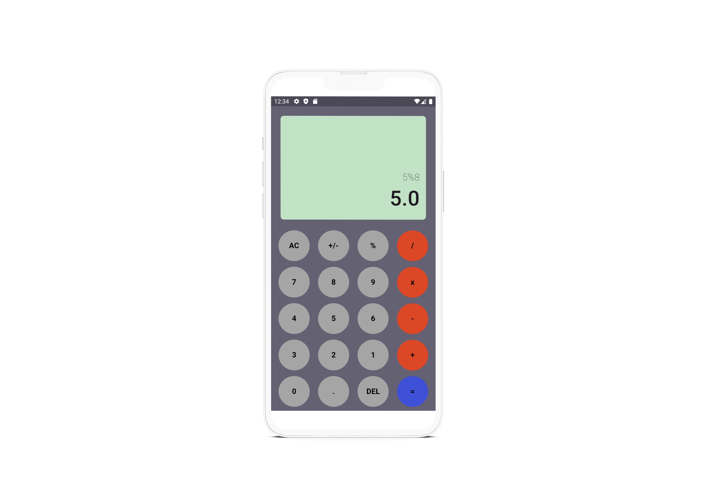

## Preview

flutter_calculator_app/
│
├── lib/
│   ├── screens/
│   │   ├── main_screen.dart          # Main calculator screen UI and logic
│   │   └── splash_screen.dart        # Splash screen that appears before the calculator loads
│   │
│   ├── utils/
│   │   └── design.dart               # Design configurations like colors, fonts, etc.
│   │
│   ├── widgets/
│   │   ├── buttons.dart              # Reusable button widget for the calculator
│   │   └── display.dart              # Reusable widget to display input and result
│   │
│   └── main.dart                     # Main entry point for the app
│
├── assets/
│   └── fonts/                        # Custom fonts used in the app (if any)
│
├── test/                             # Unit and widget testing files
│
├── pubspec.yaml                      # Project dependencies and assets configuration
├── README.md                         # Documentation of the project
└── .gitignore                        # Specifies which files to ignore in version control
